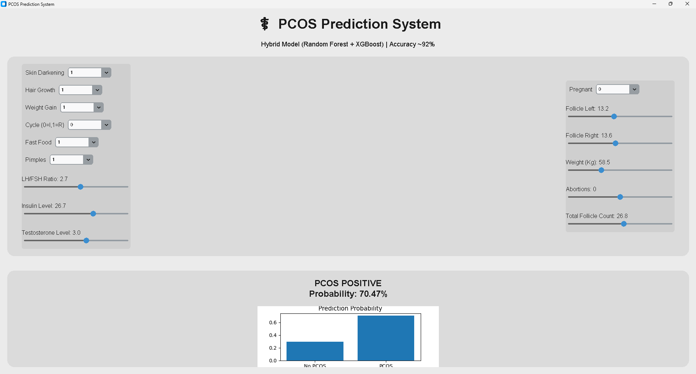

# Hybrid Machine Learning-Based PCOS Prediction System

## Overview
This project is an AI-powered PCOS Prediction System that combines Random Forest and XGBoost models with OCR-based medical report analysis.

## Features
- Hybrid ML Model (RF + XGBoost)
- OCR-based report scanning
- Automatic parameter extraction
- GUI using CustomTkinter
- Probability prediction
- Visualization graphs
- Medical report upload support

## Technologies Used
- Python
- Scikit-learn
- XGBoost
- Pandas
- NumPy
- Matplotlib
- OpenCV
- Pytesseract
- CustomTkinter

## Workflow
Medical Report → OCR → Feature Extraction → Hybrid ML Model → Prediction → Visualization

## Run Project

Install libraries:

```bash
pip install -r requirements.txt

```

Run model training:

```bash
py train_hybrid_pcos_model.py
```

Run GUI application:

```bash
py pcos_app_gui.py
```

---

## GUI Preview



---


---

## Project Structure

```text
PCOS PROJECT/
│
├── artifacts/
├── screenshots/
├── pcos_app_gui.py
├── train_hybrid_pcos_model.py
├── PCOS_data.csv
├── requirements.txt
├── README.md
```

---

## Author

Aashu
